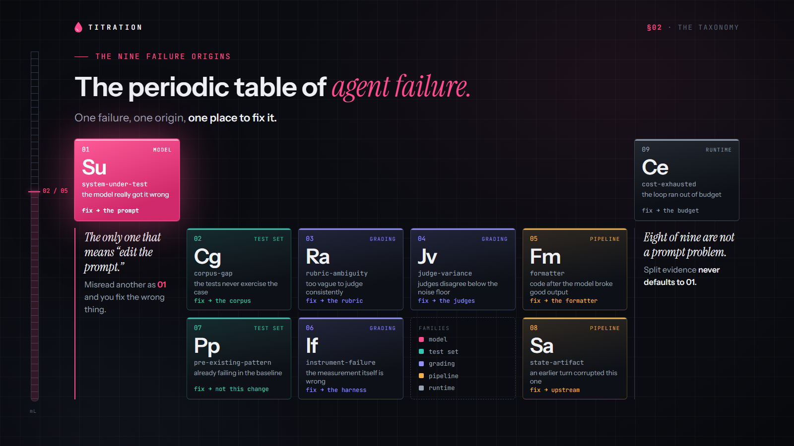
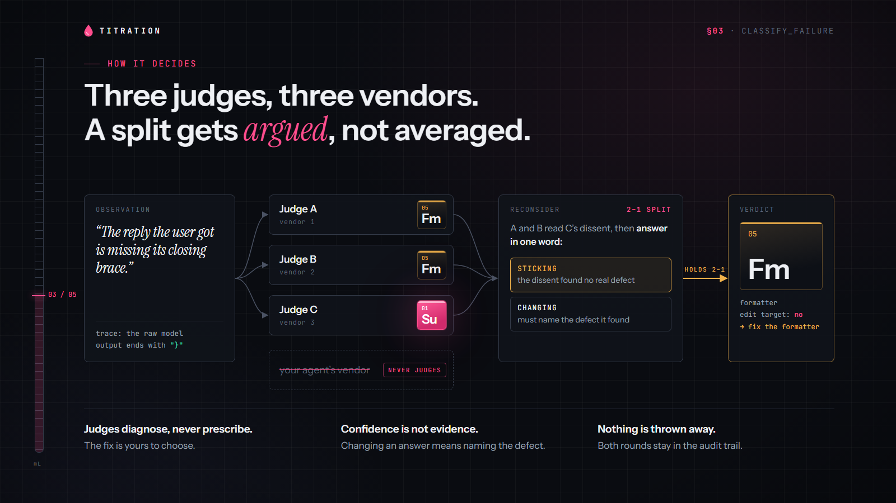
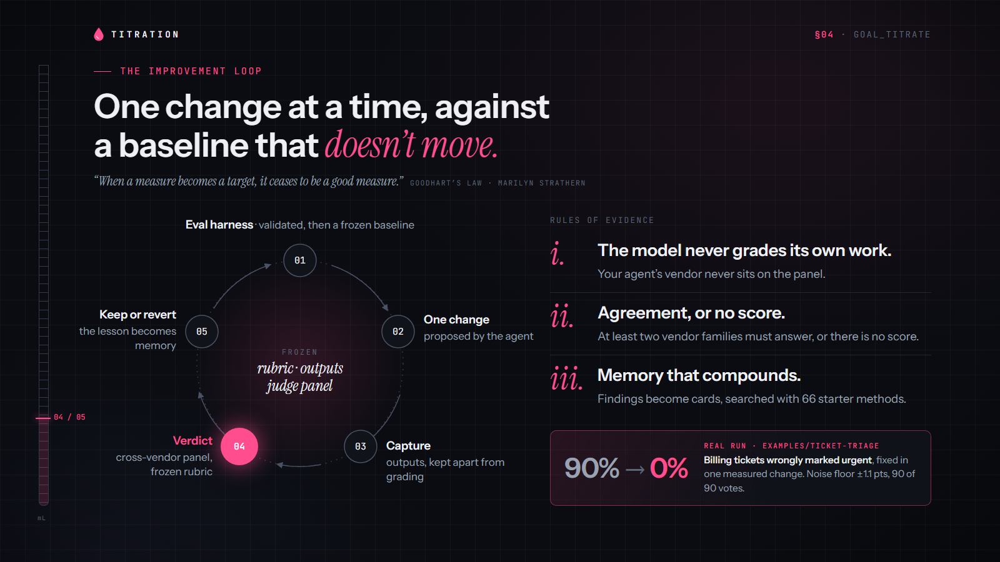

#  Titration

**Let your coding agent fix a prompt until it actually works, and prove it did.**

Point your agent at a prompt that misbehaves. It changes the prompt, reruns it, and Titration
grades every attempt against a baseline that doesn't move, with judges from *other* AI vendors.
The loop keeps going until the problem is gone, or until Titration tells you the prompt was never
the problem.

**Real run:** billing tickets wrongly marked urgent went from **90% → 0%** in one measured change
([worked example](examples/ticket-triage)).



An open-source **MCP server** with 18 tools. Self-hosted. Configuration examples for Claude Code, Codex and Cursor.
[Five-slide overview (PDF)](docs/deck/titration-deck.pdf)

## Why you can trust the loop

An agent that iterates against a score will happily game the score. Titration is built so it can't:

- **Other vendors grade the work.** Your agent's own vendor is never on the judge panel, and a
  score needs judges from at least two vendor families to answer. Fewer, and the attempt is
  refused with the reason and never scored.
- **The baseline doesn't move.** A baseline freezes its rubric, its outputs and its judges, so
  "better" always means better against the same yardstick.
- **Noise is not a win.** A change inside the judges' disagreement band comes back
  `inconclusive`, never `passed`, and a gain that breaks another group of cases doesn't ship.
- **It tells you when it isn't the prompt.** Every failure is classified into one of nine
  origins. Only one of them means "edit the prompt"; the others point at your test set, your
  rubric, your judges or the code around the model.
- **Memory that compounds.** What each run learns becomes searchable cards your agent can use
  next time, alongside a starter pack of 66 evaluation methods.
- **Yours.** Your Postgres, your keys, your judges. Nothing leaves your machine except the calls
  to the judge and embedding providers you choose.

---

## How it works

> "The first principle is that you must not fool yourself, and you are the easiest person to fool."
> (Richard Feynman)

> "When a measure becomes a target, it ceases to be a good measure."
> (Goodhart's law, as put by Marilyn Strathern)





Titration never pulls or runs your code. Your agent sends the outputs it wants judged; Titration
grades only those declared outputs against the rubric. It runs as a local MCP server over stdio,
calls the judges you pick, and stores everything in your own Postgres.

## Quickstart (about 5 minutes)

You need **Node.js 22.11+**, **Git on the server process PATH** (for repository discovery),
**Docker**, and access to judges from **three vendor families
other than your agent's own** (a panel is three judges from three families, and your agent's
family never judges its own work).

- An **[OpenRouter](https://openrouter.ai) API key** covers this on its own (12 models across 9
  families) and also turns on memory search. This is the simplest start.
- The subscription CLIs can fill up to two seats at no per-call cost: `claude`
  (`npm i -g @anthropic-ai/claude-code`), `codex` (`npm i -g @openai/codex`), and `grok`.
  With them, a panel is typically two CLIs plus one OpenRouter model.

```bash
git clone https://github.com/kaithoughtarchitect/titration.git
cd titration
docker compose up -d          # Postgres + pgvector on localhost:5432
npm install
cp .env.example .env          # then set OPENROUTER_API_KEY if you have one
npm run setup                 # applies the schema, loads the base starter pack
```

`npm run setup` is safe to re-run. Without an OpenRouter key it still loads the starter pack,
but card search (vector search) stays off until you add a key and run `npm run embed`.

### Connect your agent

The server speaks MCP over stdio. Point your client at `server/server.ts` in your clone
(replace the path). These are configuration examples, not client certifications: local or
global configuration works when that connection supplies the correct local repository roots, or
(for clients without roots support) launches the server in the project directory:

**Claude Code**

```bash
claude mcp add titration -- npx tsx /absolute/path/to/titration/server/server.ts
```

**Codex** (`~/.codex/config.toml`)

```toml
[mcp_servers.titration]
command = "npx"
args = ["tsx", "/absolute/path/to/titration/server/server.ts"]
```

**Cursor** (`.cursor/mcp.json`)

```json
{
  "mcpServers": {
    "titration": { "command": "npx", "args": ["tsx", "/absolute/path/to/titration/server/server.ts"] }
  }
}
```

The server reads `.env` from the clone itself, so no secrets go into client config.
Restart your agent after adding the server or changing its environment, so it starts a fresh MCP
process. For normal use, omit `project` and leave `TITRATION_PROJECT` unset or blank.
See [Automatic repository memory](#automatic-repository-memory) for context requirements and refusals.

### Optional: agent skills

`skills/` contains three skills that walk an agent through the whole flow —
**scout** (find what is worth measuring), **harness** (design and validate the measurement),
**improve** (baseline, then improve against it). See [skills/README.md](skills/README.md).

## Choosing judges

The first time your agent establishes a baseline, it calls `referee_panel_mint` and a small
page opens in your browser (served on `127.0.0.1` only). Pick three judges from three
different vendor families; your agent's own family is greyed out, and so is the vendor of the
model your app calls, when the agent passes it as `sut_model` (a judge may favour its own vendor). The panel is locked to that
baseline, so every later comparison uses the same judges. (Diagnosing a failure with
`classify_failure` is not grading, so that panel may include your agent's own vendor.)

| Door | Cost | Notes |
| --- | --- | --- |
| `claude` CLI | your Claude subscription | verified |
| `codex` CLI | your ChatGPT subscription | verified |
| `grok` CLI | your Grok subscription | built; unverified — help wanted |
| OpenRouter | pay per token | 12 curated models across 9 vendor families |

Edit `judges-roster.json` to change the pool. To add an OpenRouter model, first record its proof
calls with `npx tsx scripts/record-openrouter-fixtures.ts <slug>` (a fraction of a cent). For unattended runs or CI, set
`TITRATION_JUDGES` in `.env` to a comma-separated list of roster ids, or to `auto` to let
Titration pick three families you have access to (subscription CLIs first, never the Player's
family).

**What grading costs:** each judged output is one call per judge. A 20-output baseline with a
three-judge panel is 60 judge calls — free on subscription CLIs (within their usage limits),
and billed per token on OpenRouter models.

## Tools

| Area | Tools |
| --- | --- |
| Memory | `card_search`, `card_get`, `card_create`, `card_relate`, `card_distill`, `run_capture`, `propose_cards`, `edge_propose` |
| Measurement design | `harness_design`, `harness_validate` |
| Grading | `referee_panel_mint`, `referee_panel_status`, `establish_baseline`, `verify`, `classify_failure`, `job_status` |
| Improvement loop | `goal_titrate`, `goal_titrate_step` |

### Automatic repository memory

For the 14 stateful tools above (all except `classify_failure`, `harness_design`,
`propose_cards`, and `harness_validate`), standard stdio automatically selects repository memory.
**Omit `project` and leave `TITRATION_PROJECT` unset or blank.** No tenant name needs to be computed.

The MCP client must supply local repository roots. Valid file URIs and unambiguous raw absolute
local paths use the same normalization and strict validation; Windows paths with spaces are
supported. Supplied roots always win over the server's launch directory. Failed lookup, empty,
malformed/relative/nonlocal roots, or roots resolving to different repositories refuse rather than
guess a first root or use `default`.

**Clients without roots support** (observed: Codex CLI 0.160) start the server in the project they
opened. Only when a client advertises **no** roots capability, the server uses that launch directory
instead, with the same identity rules. It refuses if the launch directory is not inside a Git
repository, or is inside the Titration clone the server runs from (a launch there says nothing about
your project). Multiple roots are accepted only when they resolve to the same identity.
Git must be available to the server, and the supplied roots must resolve to usable Git metadata.

Identity uses current Git evidence: **origin wins**, otherwise the sole remote; verified local
remote links are followed, and a repository with no remote uses its canonical Git common directory.
Branches, worktrees, subdirectories and clones share memory in the same database when they resolve
to equal current anchors. On **github.com and gitlab.com only**, HTTPS, SSH and SCP-style remotes
(for example `https://github.com/team/repo.git`, `ssh://git@github.com/team/repo.git` and
`git@github.com:team/repo.git`) share an anchor, with an optional `.git` suffix. SSH forms require
an explicit `git` user for this equivalence. Elsewhere, transport/address form, SSH user and the
exact path including `.git` remain distinct: an absolute SSH path is not a home-relative SCP path.
Equivalent self-hosted addresses may therefore select separate memory; identical addresses still
share. Git's explicit `insteadOf` configuration is applied by `remote get-url` before identity is
derived. Unsupported or ambiguous forms, including explicit ports and SSH passwords, refuse
conservatively. Basenames, shared history and a fork's upstream do not
establish equivalence; unknown host aliases are not guessed. Changing or losing an anchor can
select different memory or refuse: continuity is not guaranteed, and old data is untouched.

For these 14 automatic tools, caller `project` and nonblank `TITRATION_PROJECT` are **independent matching assertions**, not
overrides. Both must match the derived scope after trimming; invalid or conflicting values,
including `default` and `__base__`, refuse. Old instructions that pass arbitrary project names
cannot redirect automatic calls. Remove obsolete naming arguments/settings, restart after changing
server configuration, and ensure the client supplies correct roots. Context/lookup/identity errors
use `REPOSITORY_CONTEXT_*`, `REPOSITORY_LOOKUP_*` or `REPOSITORY_IDENTITY_UNRESOLVED`;
assertion errors use `REPOSITORY_PROJECT_INVALID` or `REPOSITORY_PROJECT_CONFLICT`.
Refusals precede request-specific work, not the existing startup job sweep.

Keep the same repository context throughout picker mint/status, baseline, verification, job polling
(including timeout recovery), and every loop call. Ticket, baseline and job IDs do not route to
another repository. Later calls rediscover context; a roots change invalidates unfinished discovery,
not an already captured call, job or baseline. The read-only base overlay remains available to
repository reads; base writes remain refused.

**Evidence boundary:** native context observation is limited to Cursor **3.17.19 on Windows**, with
global configuration supplying raw absolute local roots. SDK **1.30.1** transport checks replay that
shape and separately simulate local/global connections and lifecycle cases. A shipped-stdio/real
Postgres check with synthetic Git metadata verified omitted-scope card/run persistence, same-repo
visibility and unrelated-repo exclusion. Claude Code (headless, Windows) was observed supplying roots;
Codex CLI 0.160 advertises none and was observed launching servers in the opened project directory.
These are not native certification of every client or setup.

### Advisory context and legacy data

In standard stdio the three advisory tools also use the current repository's memory automatically:
`classify_failure` reads its ledger, `propose_cards` checks neighbor cards for duplicates (supplied
`existing_cards` are always kept), and `harness_design` draws on its precedent. Omit `project`.
Unlike the 14 stateful tools, they **fail open**: if repository context cannot be discovered, the call
still runs, without private context. A supplied `project` or nonblank `TITRATION_PROJECT` is a
matching assertion here too; a mismatch refuses, and when discovery fails a supplied name is dropped,
so it never reads another repository's memory. `ledger: false` skips the ledger and discovery.
`harness_validate` is stateless and takes no project. Advisory context never changes a verdict.

Legacy integrations using `createMcpServer` **without** a repository resolver retain their old
selection: a valid nonblank explicit `project` wins after trimming; otherwise omitted/null/blank
input uses nonblank configured `TITRATION_PROJECT`; without either, `PROJECT_REQUIRED` refuses.
Invalid explicit input never falls back. Invalid configuration is checked only when needed
(`Invalid TITRATION_PROJECT:`), so a valid explicit project bypasses it in this legacy mode only.
Names are 1–63 lowercase letters/digits/underscores/hyphens, with a letter/digit first. Legacy
explicit `default` can access old named data; explicit `__base__` reads are allowed, but base writes
and configuring it as fallback are refused. The standalone `query/card-search.ts` CLI separately
retains `TITRATION_TENANT` and its `default` fallback, not `TITRATION_PROJECT`.

These are separate access paths, not a manual-mode flag on standard stdio. Passing `default` to an
automatic call cannot switch modes. Nothing is migrated, reassigned or redistributed, including
previously named projects.

## Contributing

Issues and pull requests are welcome — see [CONTRIBUTING.md](CONTRIBUTING.md). A good first
contribution is a new learning for the base starter pack in `docs/core-learnings/`, or
recording a verified fixture for the `grok` judge door.

## License

[Apache-2.0](LICENSE)
